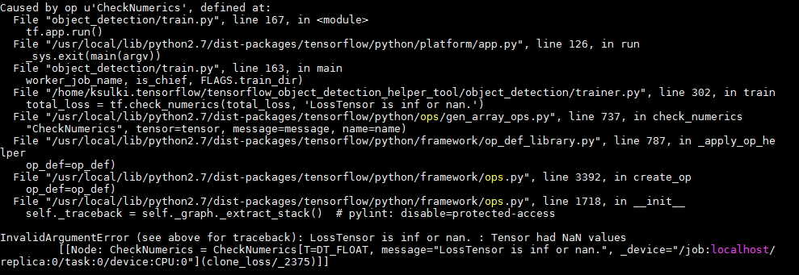
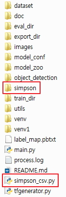
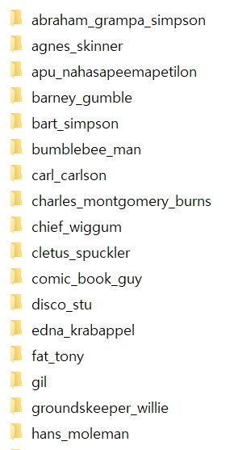
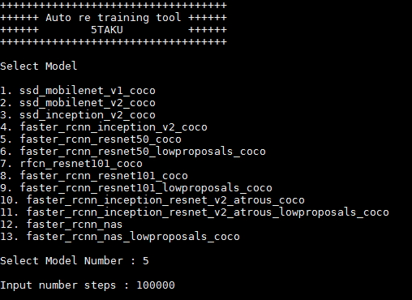
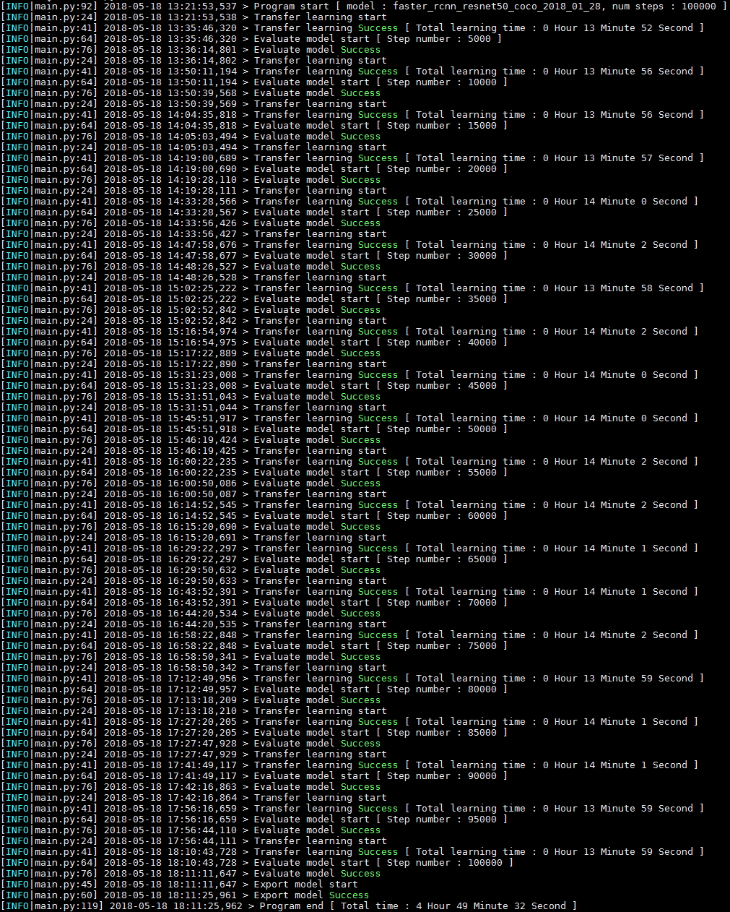
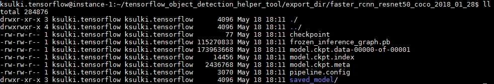

# Simpson charactors object detection

Custom Object Detection Tutorial은 [여기]()를 참고하시길 바라겠습니다.

해당 튜토리얼은 [tensorflow_object_detection_helper_tool](https://github.com/5taku/tensorflow_object_detection_helper_tool)을 활용해서 진행됩니다.

## The Simpsons Characters Data

[The Simpsons Characters Data](https://www.kaggle.com/alexattia/the-simpsons-characters-dataset)은 kaggle dataset 에 등록되어 있는 데이터 셋입니다.  

42명의 심슨 캐릭터의 사진이 각 캐릭터당 3 ~ 2000여개씩 존재하며, object detection 을 위한 bbox는 20명의 캐릭터가 200~600개씩 가지고 있습니다.  

bbox 위치의 내용은 annotations.txt 에 존재합니다.  

한 row당 filepath, x1, y1, x2, y2, character 로 구성되어 있습니다.  

tesnorflow object detection api에 활용하기 위하여 필요한 record 내용중 weight, height를 제외하고는 필요한 데이터는 전부 있습니다.  

우리는 위의 annotation.txt 파일의 내용을 토대로 tf record 파일을 생성할 것입니다.  

[tensorflow_object_detection_helper_tool](https://github.com/5taku/tensorflow_object_detection_helper_tool) 의 tfgenerator 를 그대로 사용할 수는 없습니다.  

따라서 조금의 코딩을 통하여 tensorflow_object_detection_helper_tool을 활용할 수 있도록 해보겠습니다.

## 1. Make csv file

* 문제는 annotation.txt 파일의 신뢰도가 낮다는 점입니다. xmin > xmax , ymin > ymax 인 데이터가 존재하면 training 시 에러가 발생합니다.  
   xmax - xmin < 30 , ymax - ymin < 30 이면 제외하겠습니다.
   
    
   
csv 을 생성하기만 한다면, 그 이후는 tensorflow_object_detection_helper_tool을 바로 활용할 수 있습니다.

```{.python}
import pandas as pd
from PIL import Image
from random import shuffle

bbox_datas = pd.read_csv('./simpson/annotation.txt',header=None)
bbox_datas_df = pd.DataFrame(bbox_datas)

bbox_datas_df = bbox_datas_df[[0,5,1,2,3,4]]
bbox_datas_df.columns = ['filename','class','xmin','ymin','xmax','ymax']

result = pd.DataFrame(columns=('filename','width','height','class','xmin','ymin','xmax','ymax'))

for i in range(len(bbox_datas_df)):
    bbox_data = bbox_datas_df.ix[i]

    if (bbox_data['xmax'] - bbox_data['xmin'] > 30 and bbox_data['ymax'] - bbox_data['ymin'] > 30):
        filename = bbox_data['filename']
        filename = filename.replace('characters','simpson')
        filename = filename.replace('simpson2', 'simpson')

        im = Image.open(filename)
        width,height = im.size

        result.loc[i] = ({
          'filename':filename,
          'width':width,
          'height':height,
          'class':bbox_data['class'],
          'xmin':bbox_data['xmin'],
          'ymin':bbox_data['ymin'],
          'xmax':bbox_data['xmax'],
          'ymax':bbox_data['ymax']
        })

rate = len(result)/8.0
result = result.sample(frac=1)
train_df = result[int(rate):]
validate_df = result[:int(rate)]
train_df.to_csv('./dataset/train.csv',index=None)
validate_df.to_csv('./dataset/validate.csv',index=None)

 
```

simpson_csv.py 파일을 [tensorflow_object_detection_helper_tool](https://github.com/5taku/tensorflow_object_detection_helper_tool) Tool 최상단에 위치시킵니다.    

[tensorflow_object_detection_helper_tool](https://github.com/5taku/tensorflow_object_detection_helper_tool) Tool 최상단에 simpson폴더를 생성한 후,  

The Simpsons Characters Data 의 annotation.txt 파일, 각 캐릭터 폴더를 복사합니다.  

  
  

simpson_csv.py 를 실행합니다.

    python simpson_csv.py

## 2. Make record file

[tensorflow_object_detection_helper_tool](https://github.com/5taku/tensorflow_object_detection_helper_tool) 의 tfgenerator.py를 수행합니다.  

이때, 옵션을 넣습니다.  

    python tfgenerator.py -c True -i ./
    
record 파일이 생성 됩니다.

## 3. label_map.pbtxt 변경

simpson character class에 맞게 적절하게 labal_map.pbtxt 를 변경합니다.

    item {
      id: 1
      name: 'homer_simpson'
    }
    item {
      id: 2
      name: 'ned_flanders'
    }
    item {
      id: 3
      name: 'moe_szyslak'
    }
    item {
      id: 4
      name: 'lisa_simpson'
    ...
    item {
      id: 17
      name: 'edna_krabappel'
    }
    item {
      id: 18
      name: 'nelson_muntz'
    }

## 4. Transfer learning , Evaluating , Exporting

[tensorflow_object_detection_helper_tool](https://github.com/5taku/tensorflow_object_detection_helper_tool) 의 main.py를 수행합니다.  

faster_rcnn_resnet50_coco 모델로 100,000번 트레이닝 시키도록 하겠습니다.  

Evaluating 은 5,000번 마다 수행하겠습니다.  

    python main.py -n 5000

모든 training 시간은 4시간 49분 32초가 걸렸습니다.
    
 
 
    
## 5. Export model 확인

export_dir 폴더로 이동합니다.

    ./export_dir/faster_rcnn_resnet50_coco_2018_01_28

 

