# Simpson charactors object detection

해당 튜토리얼은 [tensorflow_object_detection_helper_tool](https://github.com/5taku/tensorflow_object_detection_helper_tool)을 활용해서 진행됩니다.  
Custom Object Detection Tutorial은 [여기](https://github.com/5taku/custom_object_detection)를 참고하시길 바라겠습니다.  

# Table of contents
1. [The Simpsons Characters Data](#dataset)
2. [Tutorial](tutorial)
    1. [Make csv file](#makecsvfile)
    2. [Make record file](#makerecordfile)
    3. [label map 변경](#changelabelmap)
    4. [Training](#training)
    5. [Test](#test)
3. [결과 확인](#checkresult)
4. [결과 분석](#analysisresult)
5. [TO-DO](#todo)

## The Simpsons Characters Data <a name="dataset"></a>

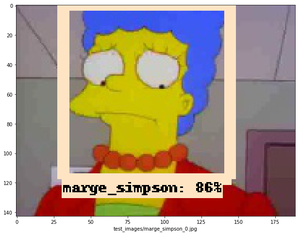 

[The Simpsons Characters Data](https://www.kaggle.com/alexattia/the-simpsons-characters-dataset)은 kaggle dataset 에 등록되어 있는 데이터 셋입니다.  

42명의 심슨 캐릭터의 사진이 각 캐릭터당 3 ~ 2000여개씩 존재하며, object detection 을 위한 bbox는 20명의 캐릭터가 200~600개씩 가지고 있습니다.  

bbox 위치의 내용은 annotations.txt 에 존재합니다.  

한 row당 filepath, x1, y1, x2, y2, character 로 구성되어 있습니다.  

tesnorflow object detection api에 활용하기 위하여 필요한 record 내용중 weight, height를 제외하고는 필요한 데이터는 전부 있습니다.  

우리는 위의 annotation.txt 파일의 내용을 토대로 tf record 파일을 생성할 것입니다.  

[tensorflow_object_detection_helper_tool](https://github.com/5taku/tensorflow_object_detection_helper_tool) 의 tfgenerator 를 그대로 사용할 수는 없습니다.  

따라서 조금의 코딩을 통하여 tensorflow_object_detection_helper_tool을 활용할 수 있도록 해보겠습니다.

## Tutorial <a name="tutorial"></a>

해당 튜토리얼은 google cloud comute engine 에서 테스트 되었으며 vm의 사양은 다음과 같습니다.

    16 vCPU
    60gb Ram
    1 x NVIDIA Tesla P100
    ubuntu 16.0.4
    python 2.7.12
    tensorflow 1.8.0
    cuda 9.0
    cudnn 7.1

### 1. Make csv file <a name="makecsvfile"></a>

* annotation.txt 파일을 csv 파일로 변경하는 소스를 만듭니다. ( simpson_csv.py 파일을 만들었습니다. )    
  문제는 annotation.txt 파일의 신뢰도가 낮다는 점입니다.   
  ( xmax 보다 xmin이 더 크거나, ymax 보다 ymin이 더 크거나 하는)  
  xmin > xmax , ymin > ymax 인 데이터가 존재하면 training 시 에러가 발생합니다.  
  xmax - xmin < 30 이거나 ymax - ymin < 30 이면 제외하겠습니다.  
   
    
   
csv 을 생성하기만 한다면, 그 이후는 tensorflow_object_detection_helper_tool을 바로 활용할 수 있습니다.

```{.python}
import pandas as pd
from PIL import Image
from random import shuffle

bbox_datas = pd.read_csv('./simpson/annotation.txt',header=None)
bbox_datas_df = pd.DataFrame(bbox_datas)

bbox_datas_df = bbox_datas_df[[0,5,1,2,3,4]]
bbox_datas_df.columns = ['filename','class','xmin','ymin','xmax','ymax']

result = pd.DataFrame(columns=('filename','width','height','class','xmin','ymin','xmax','ymax'))

for i in range(len(bbox_datas_df)):
    bbox_data = bbox_datas_df.ix[i]

    if (bbox_data['xmax'] - bbox_data['xmin'] > 30 and bbox_data['ymax'] - bbox_data['ymin'] > 30):
        filename = bbox_data['filename']
        filename = filename.replace('characters','simpson')
        filename = filename.replace('simpson2', 'simpson')

        im = Image.open(filename)
        width,height = im.size

        result.loc[i] = ({
          'filename':filename,
          'width':width,
          'height':height,
          'class':bbox_data['class'],
          'xmin':bbox_data['xmin'],
          'ymin':bbox_data['ymin'],
          'xmax':bbox_data['xmax'],
          'ymax':bbox_data['ymax']
        })

#sprit 비율은 80%로 고정하였습니다. 변경하려면 이부분을 변경하시면 됩니다.
rate = len(result)/8.0
result = result.sample(frac=1)
train_df = result[int(rate):]
validate_df = result[:int(rate)]
train_df.to_csv('./dataset/train.csv',index=None)
validate_df.to_csv('./dataset/validate.csv',index=None 
```

simpson_csv.py 파일을 [tensorflow_object_detection_helper_tool](https://github.com/5taku/tensorflow_object_detection_helper_tool) Tool 최상단에 위치시킵니다.    

[tensorflow_object_detection_helper_tool](https://github.com/5taku/tensorflow_object_detection_helper_tool) 최상단에 kaggle에서 다운받은 simpson_dataset 폴더를 복사합니다.    
또한 annotation.txt 파일을 [tensorflow_object_detection_helper_tool](https://github.com/5taku/tensorflow_object_detection_helper_tool) 최상단에 위치시킵니다.

  
  

simpson_csv.py 를 실행합니다.

    python simpson_csv.py

__simpson_csv_distribution.py__ 파일은 각 캐릭터 별로 160개씩 동일한 분포로 생성하여 줍니다.

### 2. Make record file <a name="makerecordfile"></a>

[tensorflow_object_detection_helper_tool](https://github.com/5taku/tensorflow_object_detection_helper_tool) 의 tfgenerator.py를 수행합니다.  

이때, 옵션을 넣습니다.  

    python tfgenerator.py -c True -i ./

해당 옵션의 의미는 custom csv 파일을 사용하고, imaage 폴더의 위치는 최상단(./)이라는 의미입니다.      
record 파일이 생성 됩니다.

### 3. label_map.pbtxt 변경 <a name="changelabelmap"></a>

simpson character class에 맞게 적절하게 label_map.pbtxt 를 변경합니다.
( 해당 git의 lebel_map.pbtxt를 복사하셔도 무방합니다.)

    item {
      id: 1
      name: 'homer_simpson'
    }
    item {
      id: 2
      name: 'ned_flanders'
    }
    item {
      id: 3
      name: 'moe_szyslak'
    }
    item {
      id: 4
      name: 'lisa_simpson'
    ...
    item {
      id: 17
      name: 'edna_krabappel'
    }
    item {
      id: 18
      name: 'nelson_muntz'
    }

### 4. Transfer learning , Evaluating , Exporting <a name="training"></a>

[tensorflow_object_detection_helper_tool](https://github.com/5taku/tensorflow_object_detection_helper_tool) 의 main.py를 수행합니다.  

faster_rcnn_resnet50_coco 모델로 100,000번 트레이닝 시키도록 하겠습니다.  

Evaluating 은 5,000번 마다 수행하겠습니다.  

    python main.py -n 5000

모든 training 시간은 4시간 49분 32초가 걸렸습니다.
    
 
 
    
### 5. Export model 확인

export_dir 폴더로 이동합니다.

    ./export_dir/faster_rcnn_resnet50_coco_2018_01_28

 

### 6. Test <a name="test"></a>

[The Simpsons Characters Data](https://www.kaggle.com/alexattia/the-simpsons-characters-dataset) 의 testset중 레이블이 있는 18명의 캐릭터를 테스트 해보겠습니다.
각 캐릭터당 10장의 이미지를 테스트 하였습니다.

jupyter notebook 을 기동합니다.

    jupyter notebook --ip=* --no-browser

[tensorflow_object_detection_helper_tool](https://github.com/5taku/tensorflow_object_detection_helper_tool) 최상단의 object_detection/object_detection_tutorial.ipynb 파일의 내용을 조금 수정하겠습니다.

#### Variables section

```buildoutcfg
# What model to download.
#MODEL_NAME = 'ssd_mobilenet_v1_coco_2017_11_17'
#MODEL_FILE = MODEL_NAME + '.tar.gz'
#DOWNLOAD_BASE = 'http://download.tensorflow.org/models/object_detection/'

# Path to frozen detection graph. This is the actual model that is used for the object detection.
PATH_TO_CKPT = '../export_dir/faster_rcnn_resnet50_coco_2018_01_28/frozen_inference_graph.pb'

# List of the strings that is used to add correct label for each box.
PATH_TO_LABELS = '../label_map.pbtxt'

NUM_CLASSES = 18
```

#### Download Model section

모델 다운로드는 자동으로 진행되므로, 전부 주석처리 합니다.

```buildoutcfg
# opener = urllib.request.URLopener()
# opener.retrieve(DOWNLOAD_BASE + MODEL_FILE, MODEL_FILE)
# tar_file = tarfile.open(MODEL_FILE)
# for file in tar_file.getmembers():
#   file_name = os.path.basename(file.name)
#   if 'frozen_inference_graph.pb' in file_name:
#     tar_file.extract(file, os.getcwd())
```

#### Detection section 

폴더내의 모든 이미지를 가져올수 있도록 코드를 수정합니다.

```buildoutcfg
# For the sake of simplicity we will use only 2 images:
# image1.jpg
# image2.jpg
# If you want to test the code with your images, just add path to the images to the TEST_IMAGE_PATHS.
PATH_TO_TEST_IMAGES_DIR = 'test_images'
#TEST_IMAGE_PATHS = [ os.path.join(PATH_TO_TEST_IMAGES_DIR) ]
TEST_IMAGE_PATHS = os.listdir(PATH_TO_TEST_IMAGES_DIR)

for i in range(len(TEST_IMAGE_PATHS)):
    TEST_IMAGE_PATHS[i] = 'test_images/' + TEST_IMAGE_PATHS[i]
#TEST_IMAGE_PATHS = [os.path.join(PATH_TO_TEST_IMAGES_DIR, i for i in FILE_NAME)]
print(TEST_IMAGE_PATHS)
# Size, in inches, of the output images.
IMAGE_SIZE = (12, 8)
```

## 결과 확인 <a name="checkresult"></a>

각 캐릭터당 첫번째 테스트 파일에 대한 결과입니다.  
전체 결과 이미지는 [여기](https://drive.google.com/file/d/12InWG6qac0zG1mMik4Zyz3Wo2Mvhy-7Q/view?usp=sharing) 에서 확인할 수 있습니다.  

#### True Detected sample 

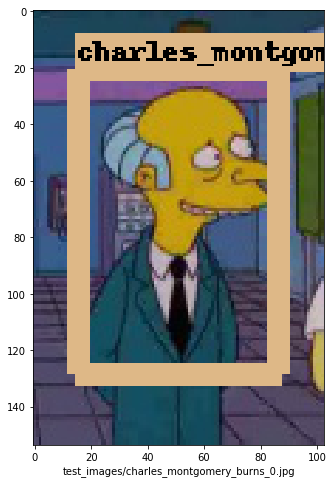 
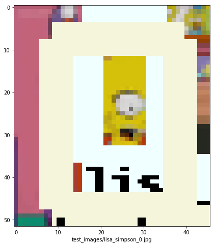 
 
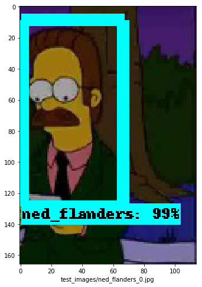 
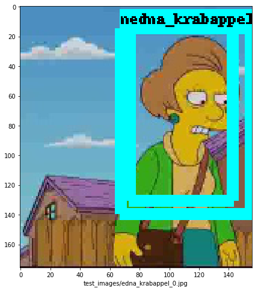 
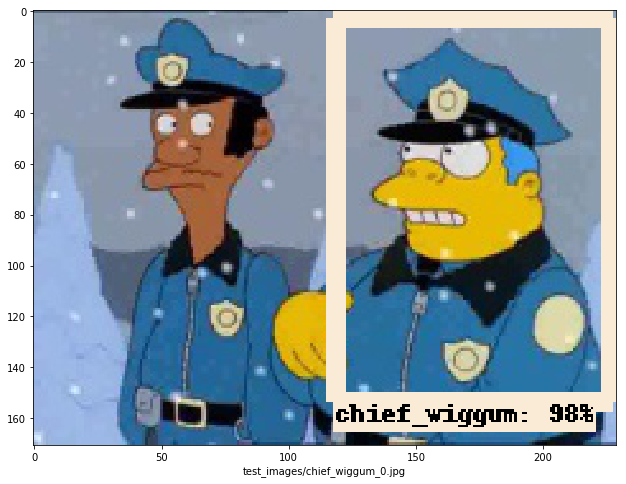 
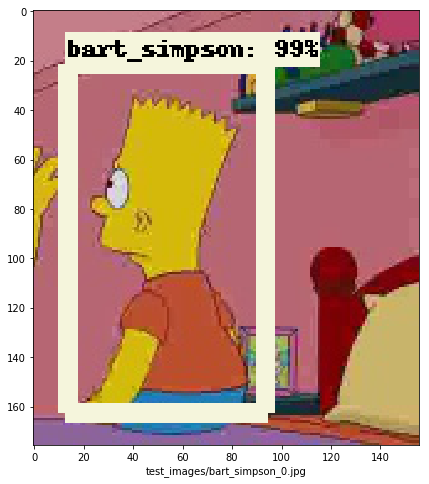 
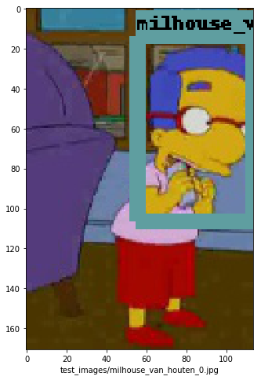 
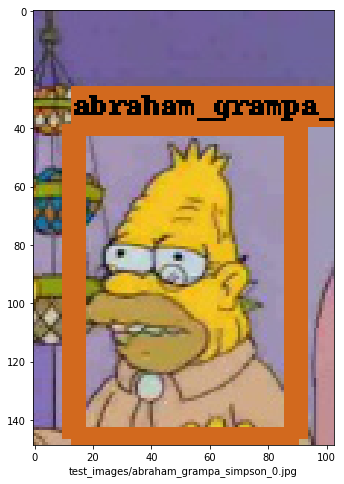 
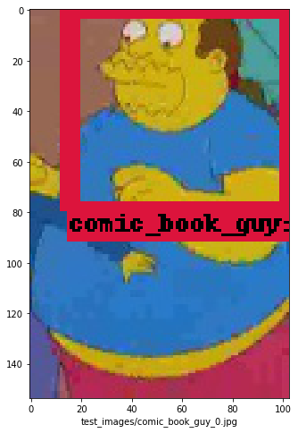 

#### Wrong Detected sample 

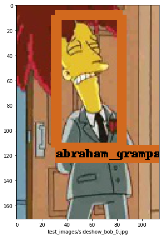 
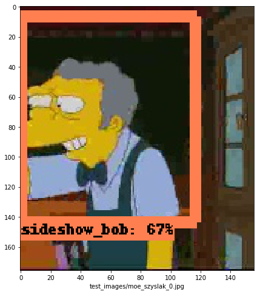 
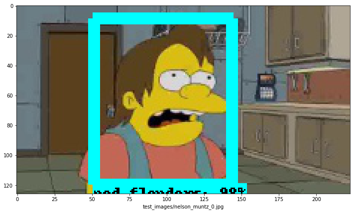 
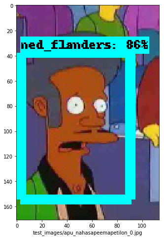 

#### No Detected sample 

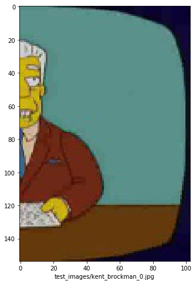 
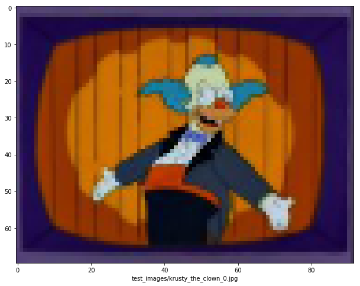 
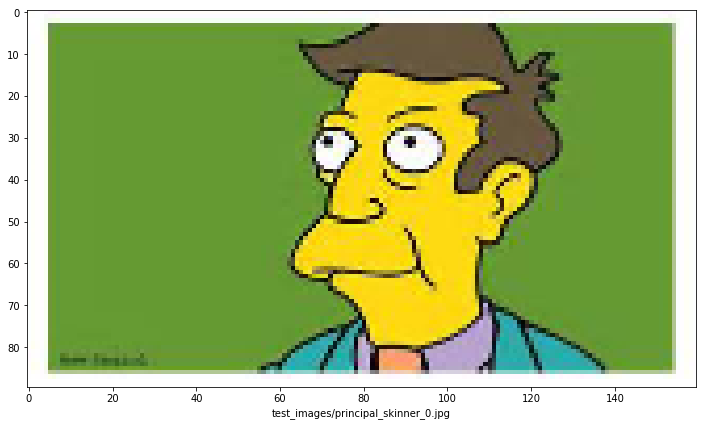 
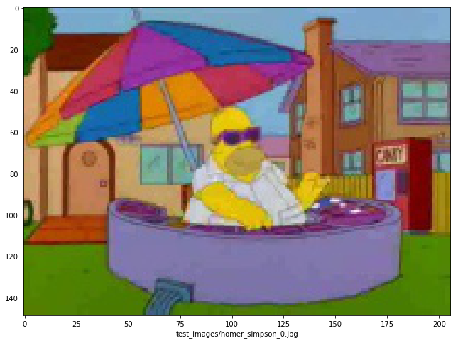 

## 결과 분석 및 추측 <a name="analysisresult"></a>

* 아래 이미지의 True, Wrong, No 는 각각 정확한 라벨링을 한경우 , 잘못된 라벨링을 한경우 , 디텍팅을 하지 못한경우 입니다.  
  널리 알려진 정확도 측정법이 아닌 눈으로 유의미하다고 판단한 자료이므로, 신뢰도 높은 정확도를 측정하려면, 추가 작업이 필요합니다.  

* 또한 아래 분석은 단지 하나의 추측에 불과합니다.  
  관련하여 잘못된 점에 대한 이야기는 언제든 환영합니다.

 

트레이닝은 총 5860장의 이미지가 사용되었습니다.  

하지만 클래스별 트레이닝 이미지의 갯수의 비율은 고르지 않습니다.  

18개의 클래스가 동등한 비율이 되려면 각 클래스당 약 5.5% 비율이 되어야 하지만 비중있는 캐릭터가 더 많은 비율을 차지합니다.  

( 조연은 웁니다...ㅜ )  

대다수의 4% 미만의 데이터의 디텍팅결과는 50% 미만입니다.  
이중에서 3.2%의 트레이닝 비율이지만 정확도는 60%인 edna_krabappel에 대하여 한번 알아보겠습니다.  

 

edna_krabappel 캐릭터는 사진에서 보이는 바와 같이, 다른 심슨캐릭보다는 좀더 눈에 띄는 특징이 있습니다.  
무엇인지 아시겠나요?  
헤어스타일입니다.  

여타 다른 캐릭보다는 좀더 뚜렷한 특징이 정확도를 높게 나오게 하지 않았나 추측해봅니다.  

반대로 charles_montgomery_burns는 9.56%의 높은 이미지 갯수에도 불구하고 정확도는 상당히 떨어집니다.  

 

시각적으로 보았을땐, 여러가지 특징이 발견되지만 결과가 좋지 않습니다.  
운이 없게 charles_montgomery_burns의 test 데이터가 판별하기 어려운 데이터 였을수도 있습니다.  

#### TO-DO 정확도 향상 <a name="todo"></a>

위의 가설이 맞는지 증명하기 위해선, 또 정확도를 향상시키기 위해선 여러 방법이 존재할것입니다.

정확도를 높이기 위하여 당장 생각나는 방법으로는   

1. Training 모델의 변경  
2. Training step의 증가 
3. 각 클래스 데이터의 균등한 배분 
4. 하이퍼 파라미터의 변경

정도가 생각나는군요.  

데이터의 갯수를 각 클래스당 160개 씩으로 균등 배분하고, 모델을 변경하여 Training step을 두배로 늘린 결과를 추후에 업데이트 하도록 하겠습니다.  

감사합니다.  